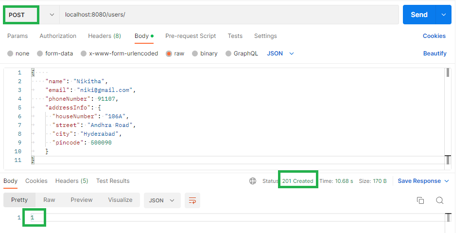
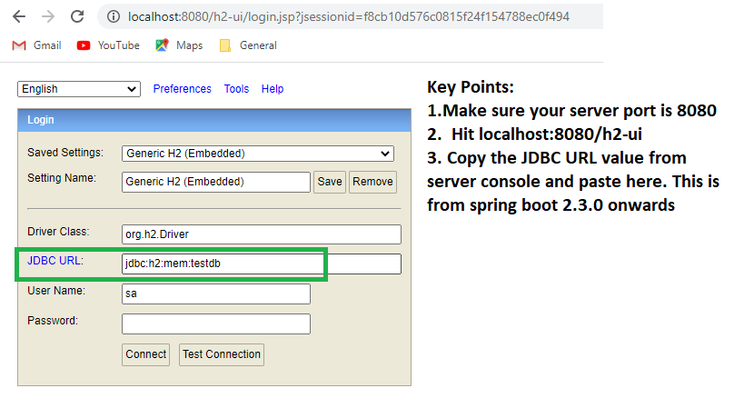
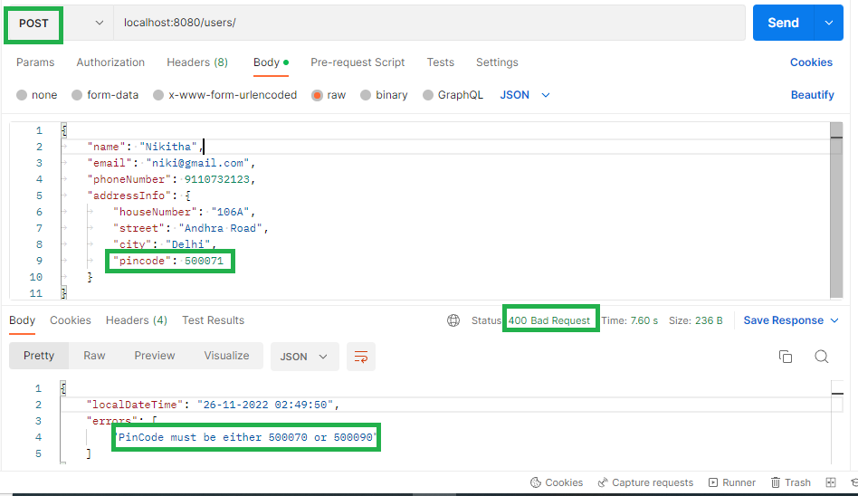
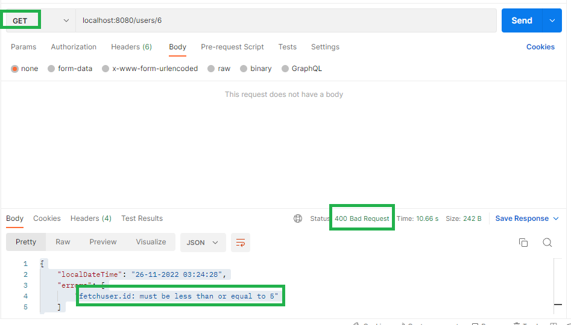
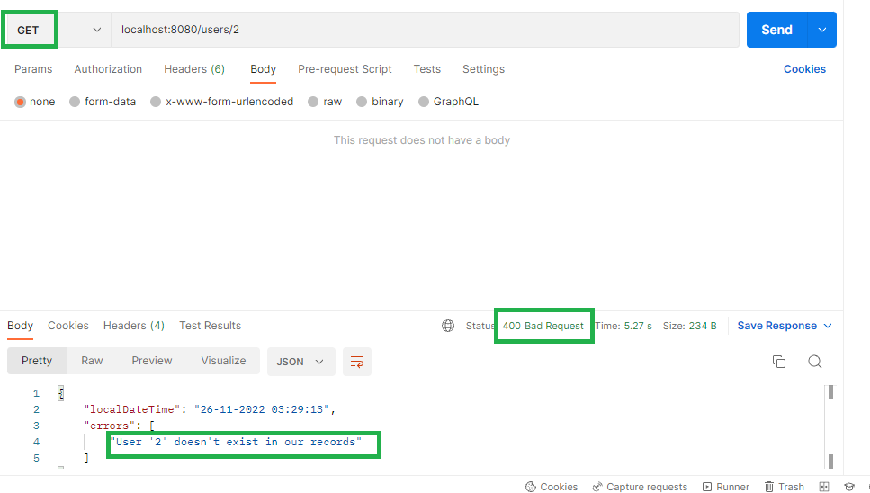
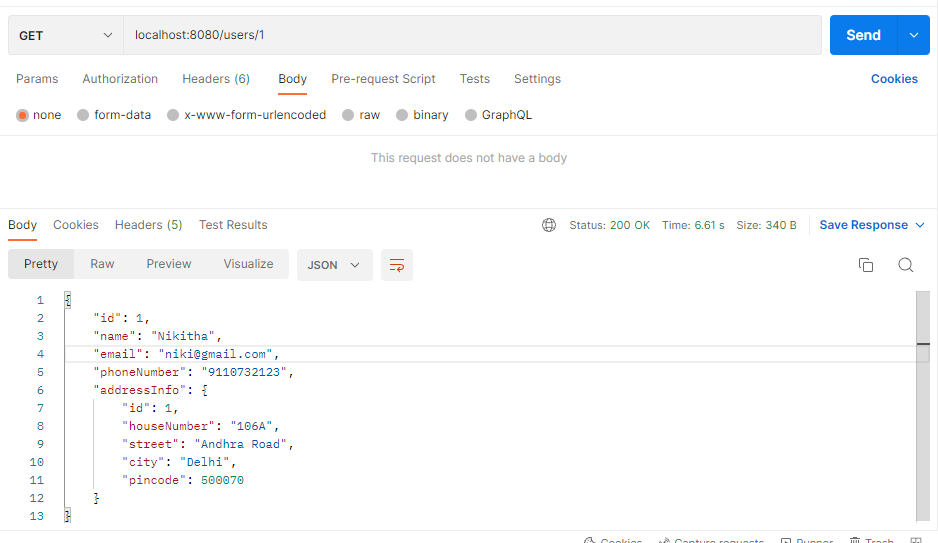

Key points:
1. Do not maintain table name as User in h2 as it is a reserved word
2. hence i maintained as users
3. I have given h2 console path as /h2-ui. Hit http://localhost:8080/h2-ui
4. Copy the database path in server console as jdbc:h2:mem:testdb and paste it in JDBC URL field at h2 console.
Postman:

h2 console:

5. Add @Valid beside to UserInfo in controller
6. Add @Valid on top of AddressInfo in UserInfo.java to jandle the validations in AddressInfo class
Post API:
localhost:8080/users/
Payload:
   {    
   "name": "",
   "email": "nikigmail.com",
   "phoneNumber": 91107,
   "addressInfo": {
   "houseNumber": "",
   "street": "Andhra Road",
   "city": "",
   "pincode": 50009
   }
   }
Response:
   {
   "localDateTime": "26-11-2022 12:06:22",
   "errors": [
   "phoneNumber must be 10 digits",
   "email is not valid",
   "name can not be blank",
   "houseNumber can not be blank",
   "pincode must be 6 digits",
   "city can not be blank",
   "city name must be between 5 & 6 letters"
   ]
   }
Status code: 400 Bad Request
Pincode Custom Validation:

Validation for Path Variables:
Add @Validated on Controller class level
Add valdiation specific annotation beside Path variable or Request Parameter
@Validated can also be used for partial fields validation in a UserInfo
These exceptions are ConstraintViolationException

Validation for UserNotFoundException

Fetch USer API:

