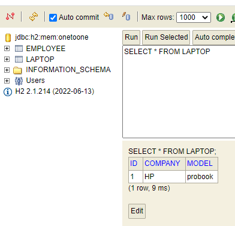
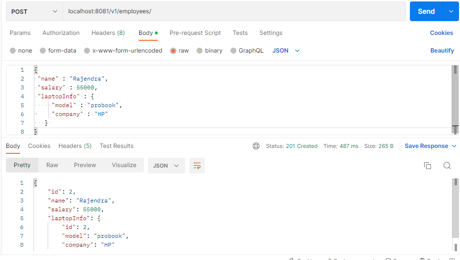
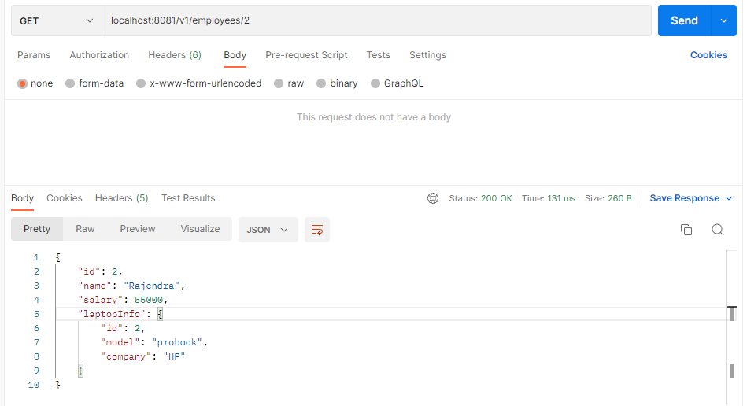
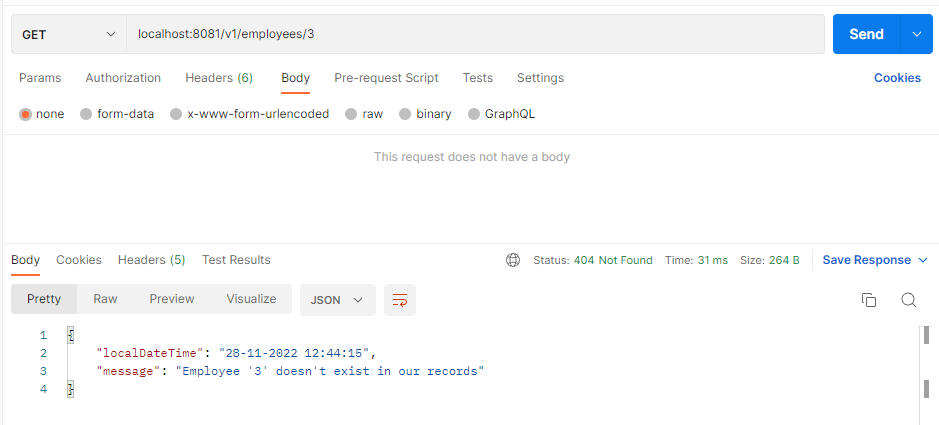

KeyPoints:
1. Here Parent Entity is Laptop (Non Owning Side)
2. Employee Entity is Child (Owning Side)
3. Good Practice is to keep @OneToOne(cascade = CascadeType.ALL, optional = false) in child entity i.e Employee
4. So that it would create Laptop_Id column in Employee table which references the primary key of Laptop table.
5. if you want to modify this column name, then add @JoinColumn(name = "LTop_Id")
6. By default @OneToOne fetch type is EAGER. However,you can change to @OneToOne(fetch = FetchType.LAZY)
7. This example describes unidirectional mapping. Hence @OneToOne is added only in Employee entity
8. Added @RequiredArgsConstructor on top of Entity classes and @NonNull on top of column names which we are interested in teh constructor.

Laptop Table:

Employee Table:

