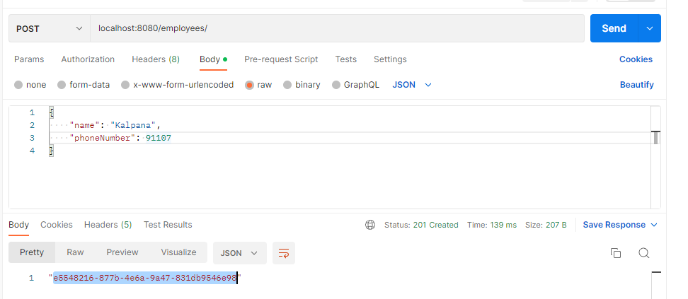
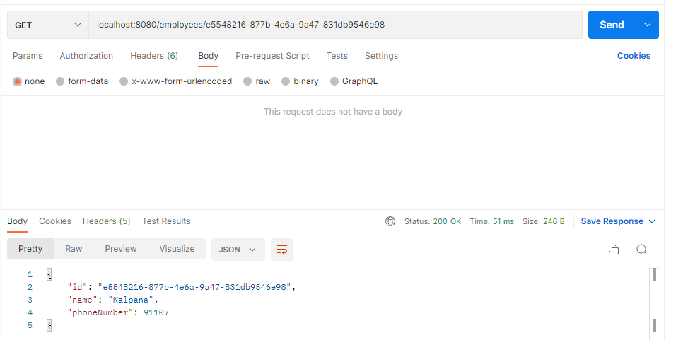
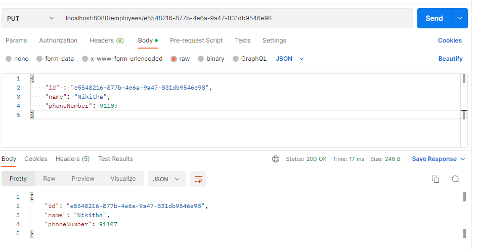
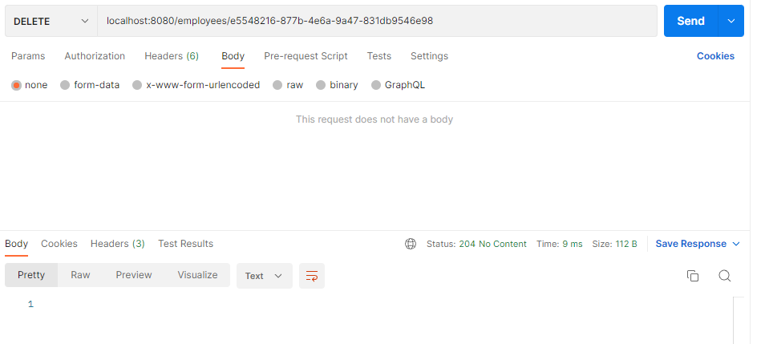
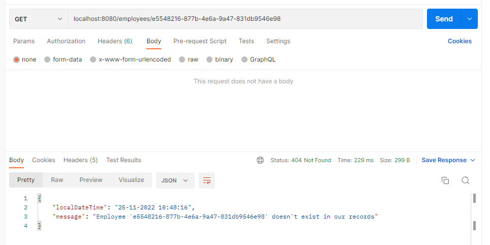

This example describes the below items
1. Define custom exception  by extending RuntimeEception
2. Write a separate class with @RestControllerAdvice on top of class name.
3. write @ExceptionHandler(YourCustomException.class) on top of method like below.
   @ExceptionHandler(EmployeeNotFoundException.class)
   public ResponseEntity<ErrorResponse> handleEmployeeNotFoundException(EmployeeNotFoundException ex) {
   ErrorResponse errorResponse = new ErrorResponse(ex.getLocalizedMessage());
   return new ResponseEntity<ErrorResponse>(errorResponse, HttpStatus.NOT_FOUND);
   }
4. Date is formatted with @JSONFormat in the response.

Create Employee :

Get Employee:

Update Employee:

Delete Employee:

Get Employee with invalid id:

